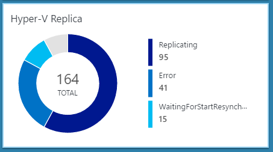
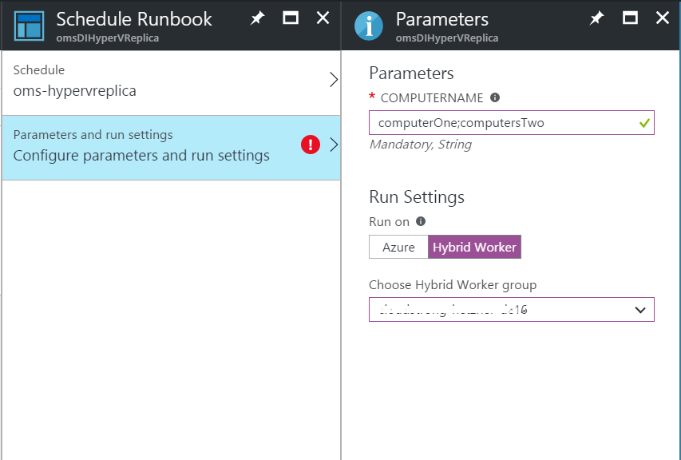

# Hyper-V Replica Solution for OMS

[](https://portal.azure.com/#create/Microsoft.Template/uri/https%3A%2F%2Fraw.githubusercontent.com%2Fbentaylorwork%2Fazure-arm-templates%2Fmaster%2Foms-solution-hypervReplica%2Fazuredeploy.json) 
[](http://armviz.io/#/?load=https%3A%2F%2Fraw.githubusercontent.com%2Fbentaylorwork%2Fazure-arm-templates%2Fmaster%2Foms-solution-hypervReplica%2Fazuredeploy.json) 

## Overview

An OMS Solution that helps you manage Hyper-V replica. It give you visibility of the current replication state. It only shows data from the primary replica host.

**Overview Screen**


**Tile Screen**



## Prerequisites

- **Hyper-V Hosts With Hyper-V Replica**
- **OMS Workspace**
- **Automation Account**
- **Hybrid Workers with access to the Hyper-V Hosts**
- **OMSDataInjection PowerShell module installed on the Hybrid Workers**

## Installation

1) Install the OMSDataInjection PowerShell module on the Hybrid Workers.

	```powershell
	Install-Module -Name OMSDataInjection
	```
2) Install the Hyper-V replica OMS solution. 
	 
	This can be installed by any supported method.

	When installing the OMS Solution you will be asked for the following parameters.

    * workspaceName - The name of your OMS Log Analytics workspace.
    * workspaceRegionId - The region of your OMS Log Analytics workspace.
    * accountName - The name of the Automation account to use.  If this account exists, check the pricing tier and tags to make sure they match the exisitng account.
    * regionId - The region the Automaiton account is located in.
    * pricingTier - The pricing tier for the Automation account.
    * onPremisesRunAsUserName - The username for the Account That Has Access To The On-Premises servers.
    * onPremisesRunAsPassword - The password for the Account That Has Access To The On-Premises servers.
    * workSpaceID - The Workspace ID for your OMS workspace.
    * workSpacePrimaryKey - The Workspace Primary Key for your OMS workspace.

3) Create an automation schedule specifying how often you want the information in the Hyper-V replica OMS Solution updating.


4) Link the schedule to the 'Publish-omsHyperVReplica.ps1' Run Book, also selecting the location the Run Book should run to your on premises Hybrid Runbook Worker group. You will be asked to fill in the computerName parameter, this is a list of the servers you want to monitor, each server is seperated by a semi-colon - ';'.



## Versions
### 1.0.0.0
* Initial release with the following support:
    * VMs at each status.
    * Amount of VMs with broken replicas on each host.
    * Run Number for only displaying the latest results.

## Limitations
* No support for latency or replica sizes
* No auto fixing of common replica errors

## Contributors
- Ben Taylor - ben@bentaylor.work