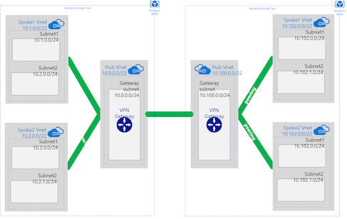

# A Global Hub and Spoke Network Topology

## Overview
This template deploys a hub and spoke network into two separate Resource Groups which can be in different regions. The two hub networks are connected via VPN gateways.

The amount of spokes and the configuration can be altered in the spokes array of the variables section, all peering is dynamic, so new spokes are automatically peered to the hub vnet.

## Notes
* The two Resource Groups where you want to deploy the resources must be created prior to the deployment of this template.

## Links
https://docs.microsoft.com/en-us/azure/architecture/reference-architectures/hybrid-networking/hub-spoke

## Contributors
* Ben Taylor - ben@bentaylor.work